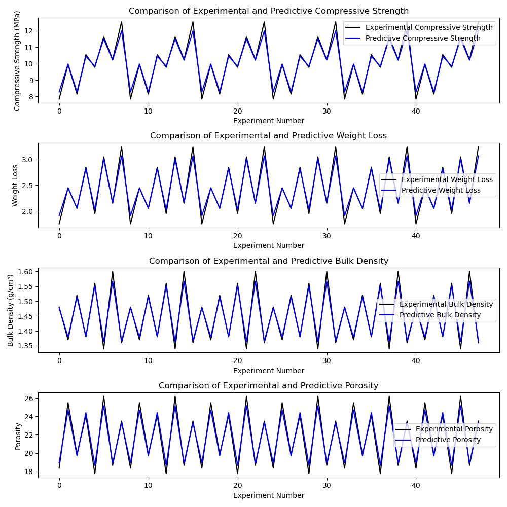

# Clay Property Analysis Using Machine Learning (XGBoost and Grid Search)
Regression analysis using XGBoost algorithm combined with k-fold cross-validation to evaluate the predictive performance of firing temperature and clay type on the properties of fired bricks, including compressive strength, weight loss, bulk density, and porosity
This approach uses the XGBoost model with hyperparameter tuning to improve the predictive performance. It also preprocesses the data and uses encoding for categorical features of clay types.
Grid Search for Hyperparameter Tuning is used to find the best combination of n_estimators and max_depth that gives the best model performance.
To address the mismatch issue, we used k-fold cross-validation to better evaluate the performance of the model on limited datasets.

## Tasks
1. Import the necessary libraries, load and prepare the dataset.
2. Encode categorical variable
3. Hyperparameter grid for XGBoost
4. Convert the results dictionary to a DataFrame
5. Export the results to an Excel sheet
6. Plot for Compressive Strength, Weight Loss, Bulk Density and Porosity

## Comparison plots

